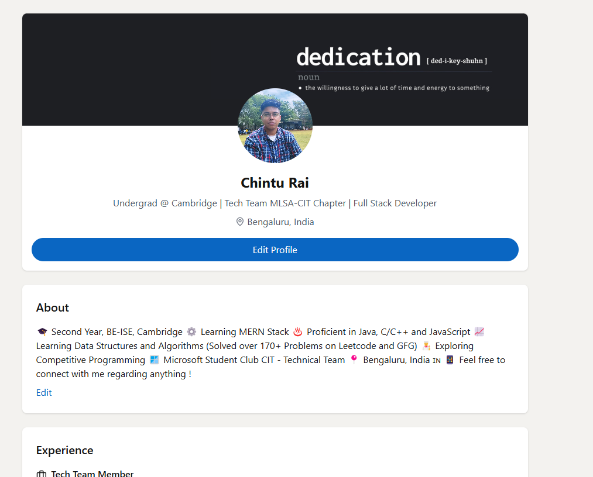

# LinkedIn Clone - By Chintu Rai 🌐

A full-stack LinkedIn clone built using the **MERN stack** (MongoDB, Express.js, React.js, Node.js) with modern features like authentication, payment integration, and social networking capabilities.

## 📸 Demo Screenshots

### Home Page


### Post Interaction


### Profile Header Section


### Profile Details Section


### Notifications


### Connection Requests


## 🚀 Features

- 🗄️ **MongoDB Integration** - Efficient data storage and retrieval.
- 🔐 **Authentication System with JWT** - User authentication with JSON Web Tokens.
- ✉️ **Welcome Emails** - Automated email system for new users.
- 🎨 **Design with Tailwind & DaisyUI** - Beautiful and responsive UI.
- 🛡️ **Data Protection** - Secure handling of user data.
- 🤝 **Connection Requests** - Send, accept, and reject friend requests.
- 📝 **Creating and Sharing Posts** - Share professional updates.
- 🖼️ **Image Upload** - Profile and post image uploads.
- 👤 **Profile Creation and Updates** - Customize user profiles.
- 👥 **Suggested Users Feature** - Discover new connections.
- 👍 **Like and Comment on Posts** - Engage with content.
- 📰 **News Feed Algorithm** - Smart content sorting.
- ⌛ **And a lot more...**

## 🛠️ Tech Stack

- **Frontend:** React.js, Tailwind CSS, DaisyUI
- **Backend:** Node.js, Express.js
- **Database:** MongoDB
- **Authentication:** JWT, bcrypt
- **Email Service:** Mailtrap

## 🚀 Getting Started

### Prerequisites
- Node.js (v14 or higher)
- MongoDB
- npm or yarn

### Installation

1. Clone the repository
   ```bash
   git clone https://github.com/yourusername/linkedin-clone.git
   cd linkedin-clone
   ```

2. Install dependencies for both frontend and backend
   ```bash
   # Install root dependencies
   npm install
   
   # Install frontend dependencies
   cd frontend
   npm install
   
   # Install backend dependencies
   cd ../backend
   npm install
   ```

3. Set up environment variables
   - Create a `.env` file in the backend directory based on the `.env.example` template
   - Configure your MongoDB connection string, JWT secret, and other required variables

4. Start the development servers
   ```bash
   # Start backend server
   cd backend
   npm run dev
   
   # Start frontend server (in a new terminal)
   cd frontend
   npm start
   ```

5. Open your browser and navigate to `http://localhost:3000`

## 🌟 Key Features Explained

### Authentication System
The application uses JWT (JSON Web Tokens) for secure authentication, allowing users to register, login, and maintain sessions securely.

### Social Networking
- **Connection Management**: Send, accept, or reject connection requests
- **News Feed**: View and interact with posts from connections
- **Notifications**: Real-time notifications for social interactions

### Profile Management
Users can create and customize their professional profiles with:
- Profile pictures
- Work experience
- Education
- Skills
- About section

### Post Interaction
- Create text and image posts
- Like and comment on posts
- Share posts with your network

## 🤝 Contributing

Contributions are welcome! Please feel free to submit a Pull Request.

1. Fork the repository
2. Create your feature branch (`git checkout -b feature/amazing-feature`)
3. Commit your changes (`git commit -m 'Add some amazing feature'`)
4. Push to the branch (`git push origin feature/amazing-feature`)
5. Open a Pull Request

## 📝 License

This project is licensed under the MIT License - see the LICENSE file for details.


---

⭐️ If you found this project helpful, please give it a star on GitHub! ⭐️


